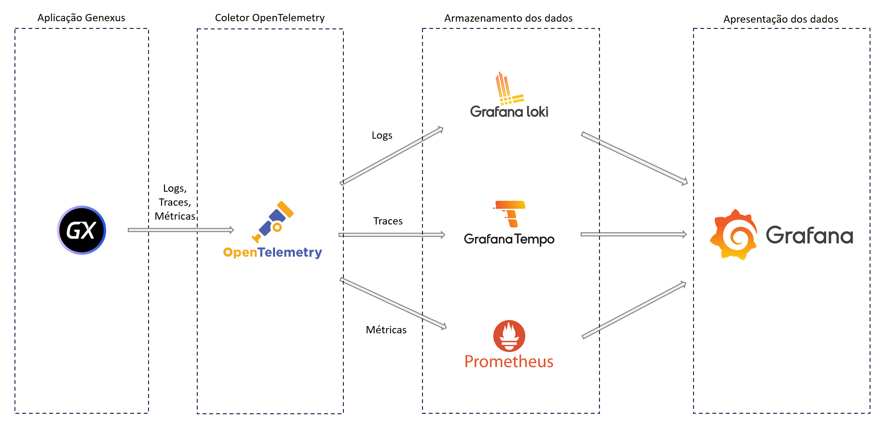

# Atividade 1

Vamos entender um pouco o conceito de observabilidade e elementos de sofware que fazem parte da implementação da observabilidade no Genexus.

### Observabilidade

Observabilidade em uma aplicação é a capacidade de entender o estado interno de um sistema apenas observando suas saídas. Isso é especialmente importante em ambientes de produção, onde você não tem acesso direto ao sistema. A observabilidade é alcançada através de três pilares principais: logs, métricas e rastreamento distribuído.

No contexto de observabilidade de uma aplicação, um log é um registro de eventos que ocorreram no sistema. Esses eventos podem incluir erros, transações, solicitações de usuários e qualquer outra atividade que ocorra dentro do sistema. Logs são essenciais para entender o que aconteceu no sistema em um determinado momento. Eles são frequentemente usados para diagnosticar problemas, monitorar o desempenho do sistema e realizar análises de segurança.

O rastreamento (trace) é um dos pilares da observabilidade que permite acompanhar uma solicitação à medida que ela passa por vários serviços em um sistema distribuído. Cada operação que a solicitação passa é registrada, criando um "trace" ou rastreamento da solicitação. Isso permite que os desenvolvedores vejam exatamente como uma solicitação se move através do sistema, o que pode ser útil para identificar gargalos de desempenho, falhas ou outros problemas.

Métricas são medidas quantitativas do comportamento do sistema ao longo do tempo. Elas podem incluir coisas como uso de CPU, memória, tempo de resposta de rede, número de solicitações por segundo, entre outros. As métricas são úteis para entender o desempenho geral do sistema, identificar tendências ao longo do tempo e alertar sobre condições anormais.

Esses três pilares permitem que os desenvolvedores e operadores entendam o que está acontecendo dentro de um sistema, identifiquem problemas e otimizem o desempenho.

### Observabilidade no Genexus

O Genexus implementou recursos de observabilidade a partir da versão 18 upgrade 5:
- [Observabilidade no Genexus](https://wiki.genexus.com/commwiki/wiki?53773,Observability+in+GeneXus+Apps)

Configurando o Genexus adequadamente uma aplicação gerada pelo Genexus pode exportar logs, métricas e traces para que sejam apresentados em aplicações de monitoramento como Grafana, Azure Application Insigths, entre outros.

Iremos utilizar a opção "Opentelemetry" como provider de observabilidade no Genexus, neste caso será necessário a utilização do OpenTelemetry collector para receber os logs, traces e métricas da aplicação e enviar para aplicação de análise.

### Coletor Open Telemetry

OpenTelemetry Collector é uma implementação de código aberto que permite aos desenvolvedores coletar telemetria de seus aplicativos e exportá-la para várias plataformas de análise. Ele suporta a coleta de métricas, rastreamentos e logs.

O Collector é projetado para ser um componente intermediário, o que significa que pode receber dados de várias fontes, transformá-los conforme necessário e, em seguida, exportá-los para vários destinos. Isso torna o Collector uma peça central na arquitetura de observabilidade, pois permite a interoperabilidade entre diferentes sistemas e ferramentas.

### Grafana

Grafana é uma plataforma de análise e visualização de dados de código aberto. É comumente usada para visualizar séries temporais de dados de infraestrutura e aplicativos e criar painéis com gráficos ricos. Com Grafana, você pode criar alertas, notificações e ad-hoc explorar seus dados além de apenas visualizá-los. É muito usada em conjunto com outras ferramentas de observabilidade para monitorar o desempenho e a saúde de aplicações e sistemas.

Para armazenar as informações dos logs, traces e métricas são utilizados "Bancos de dados" específicos para cada tipo de informação, no caso do Grafana Cloud os softwares utilizados são os seguintes:

| Tipo de informação | Software de armazenamento |
| -------- | -------- |
| Log  | Loki  |
| Trace  | Tempo  |
| Métrica  | Prometheus  |

O diagrama abaixo apresenta a arquitetura dos componentes:

Próxima atividade: [Atividade 02](docs/02-atividade.md)

