# Atividade 2

### Configurar o coletor OpenTelemetry
O arquivo collector.yaml é um arquivo de configuração usado pelo OpenTelemetry Collector. Ele define como o coletor deve funcionar, incluindo quais dados ele deve coletar, como deve processá-los e onde deve exportá-los.

Aqui está um exemplo de como você pode estruturar este arquivo:
```yaml
receivers:  # Define quais dados o coletor deve receber
    otlp:
        protocols:
            grpc:
            http:

processors:  # Define como os dados devem ser processados
    batch:

exporters:  # Define para onde os dados devem ser enviados
    logging:
        loglevel: debug

service:  # Define a ordem em que receivers, processors e exporters são chamados
    pipelines:
        traces:
            receivers: [otlp]
            processors: [batch]
            exporters: [logging]
```
No exemplo acima, o coletor está configurado para receber dados via OTLP (OpenTelemetry Protocol) sobre os protocolos gRPC e HTTP, processar esses dados em lotes e, em seguida, exportá-los para um logger com nível de log definido como debug.

- [Configuração do OpenTelemetry Collector](https://opentelemetry.io/docs/collector/configuration/)

#### Passo 1
Agora vamos configurar o exporter do Prometheus para exportarmos as métricas.
Abrir um linha de comando e ir até a pasta appjava, e editar o arquivo collector.yaml

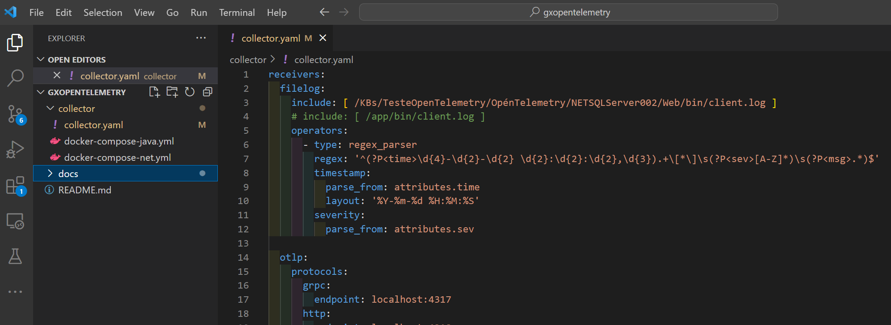


#### Passo 2
Acessar o Grafana Cloud para pegar as chaves de autenticação, e configurar o coletor para acessar os serviços do Grafana Cloud.

- [https://grafana.com/](https://grafana.com/)


Clicar no botão "My Account".

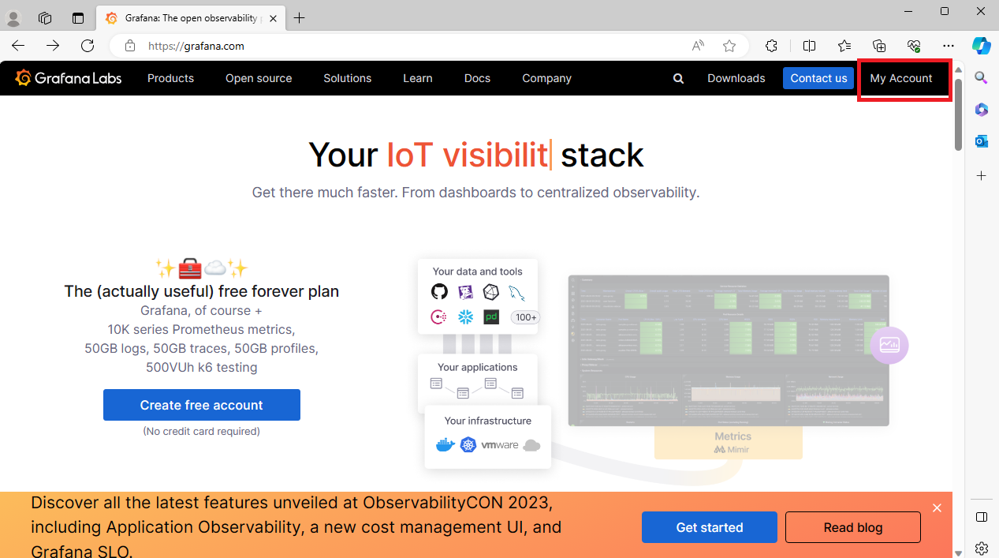


Após o login serão apresentados os componentes do Grafana Cloud disponíveis na conta.

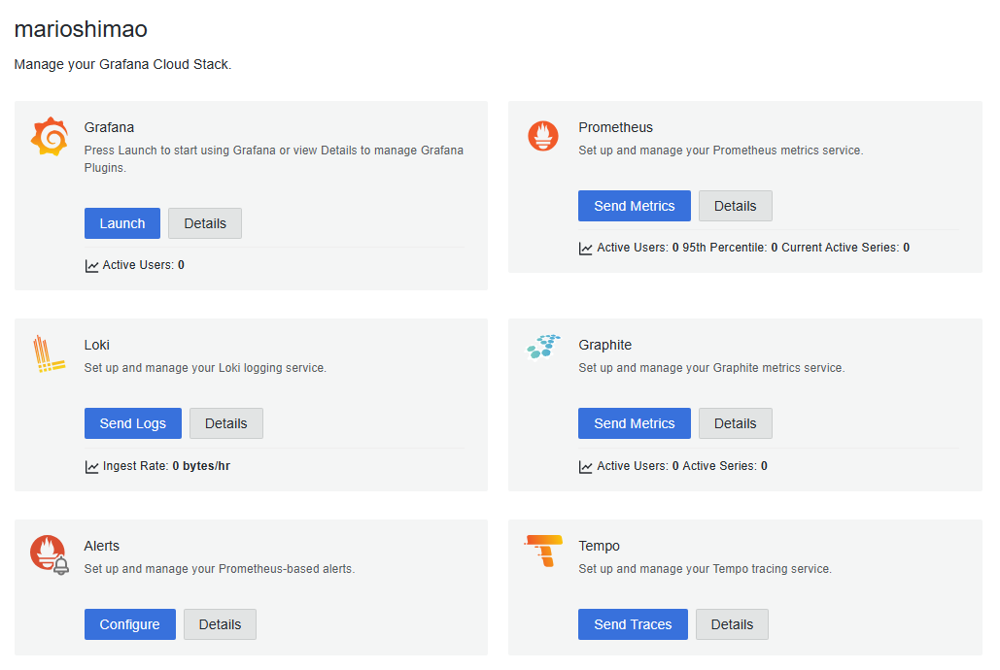


#### Passo 3
Clicar na opção "Send Metrics" do Prometheus.

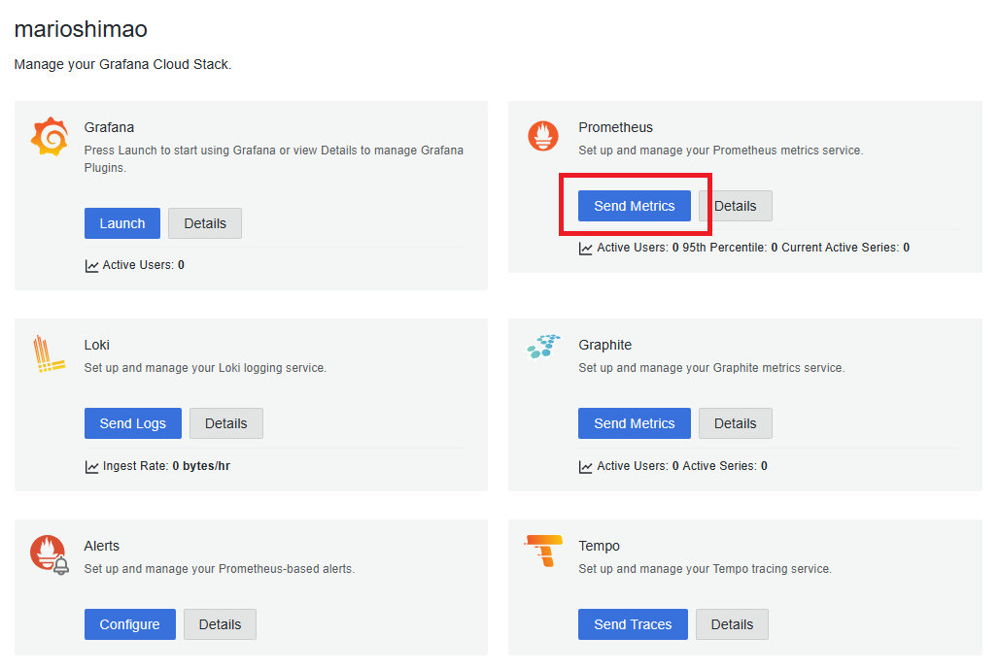


Copiar o endpoint "Remote Write Endpoint" e colar no endpoint do Prometheus no arquivo collector.yaml.

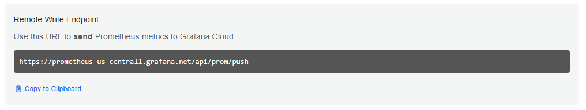

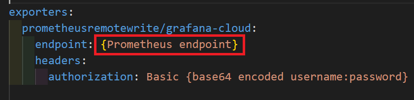


Clicar em "Generate Token" para gerar o token de acesso ao Prometheus.

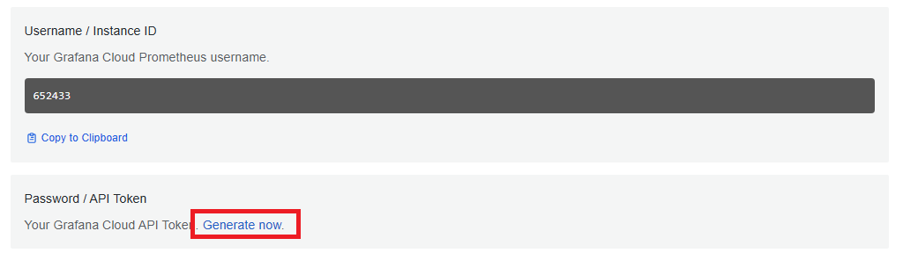


No popup informar o nome do token e clicar em "Create token".

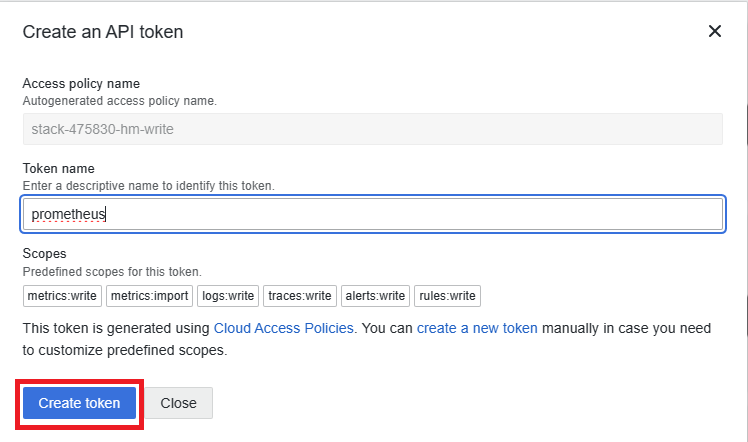


Copiar o token gerado e guardar num arquivo texto.

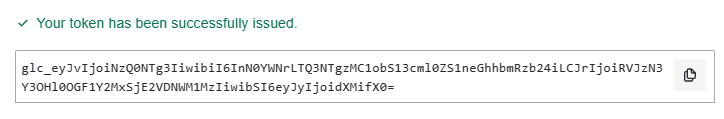


Copiar o Username e usando um encoder base64, encodar a string "username:token". Para isso você pode utilizar o DevToys uma ferramenta gratuida para Windows que possui várias funções úteis para o dia a dia.

- [Download DevToys](https://devtoys.app/)

Você também pode usar um o site https://www.base64encode.org/ para fazer o encode.


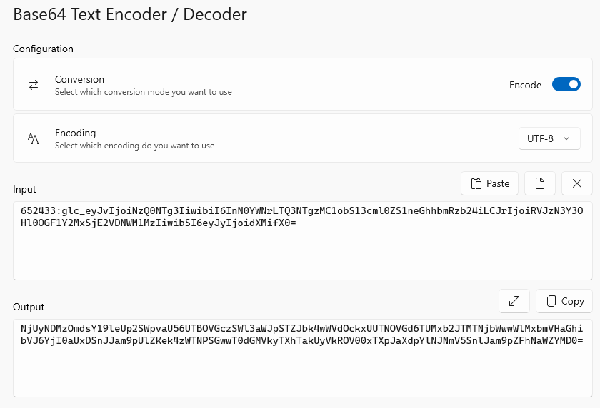


Copiar a string resultante do encoding e substituir a tag {base64 encoded username:password} da configuração do Prometheus no arquivo collector.yaml.

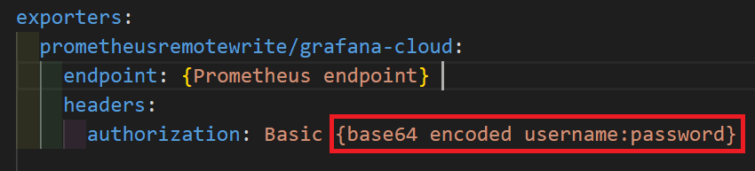


Próxima atividade: [Atividade 03](03-atividade.md)


