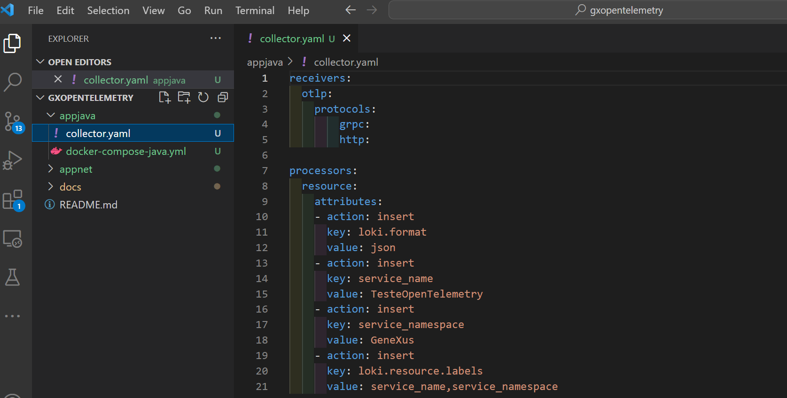
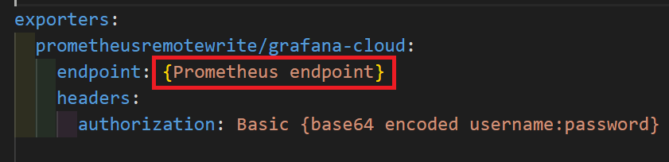
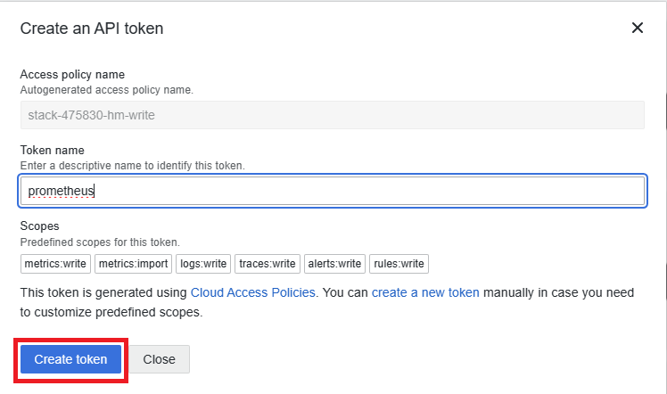
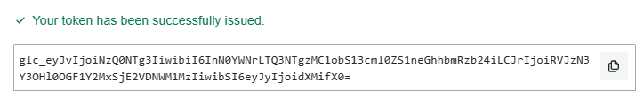
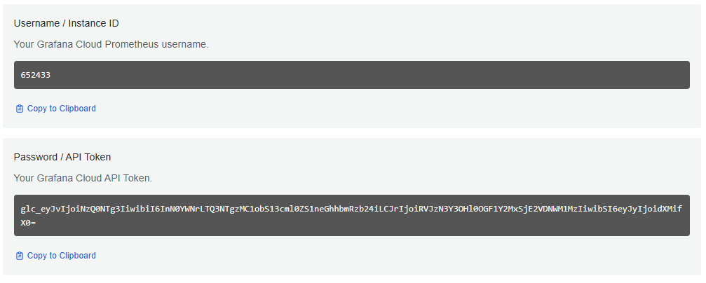

# Atividade 3

### Configurar o coletor OpenTelemetry

#### Passo 1
Abrir um linha de comando e ir até a pasta collector, e editar o arquivo collector.yaml

#### Passo 2
Acessar o Grafana Cloud para pegar as chaves de autenticação, e configurar o coletor para acessar os serviços do Grafana Cloud.

- [https://grafana.com/](https://grafana.com/)

Clicar no botão "My Account".

Após o login serão apresentados os componentes do Grafana Cloud disponíveis na conta.

#### Passo 3
Clicar na opção "Send Metrics" do Prometheus.

Copiar o endpoint "Remote Write Endpoint" e colar no endpoint do Prometheus no arquivo collector.yaml.

Clicar em "Generate Token" para gerar o token de acesso ao Prometheus.

No popup informar o nome do token e clicar em "Create token".

Copiar o token gerado e guardar num arquivo texto.

Copiar o Username e usando um encoder base64, encodar a string "username:token".

Copiar a string resultante do encoding e substituir a tag {base64 encoded username:password} da configuração do Prometheus no arquivo collector.yaml.

Próxima atividade: [Atividade 04](docs/04-atividade.md)

